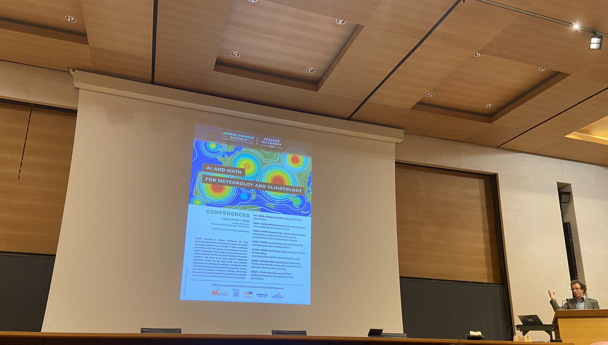
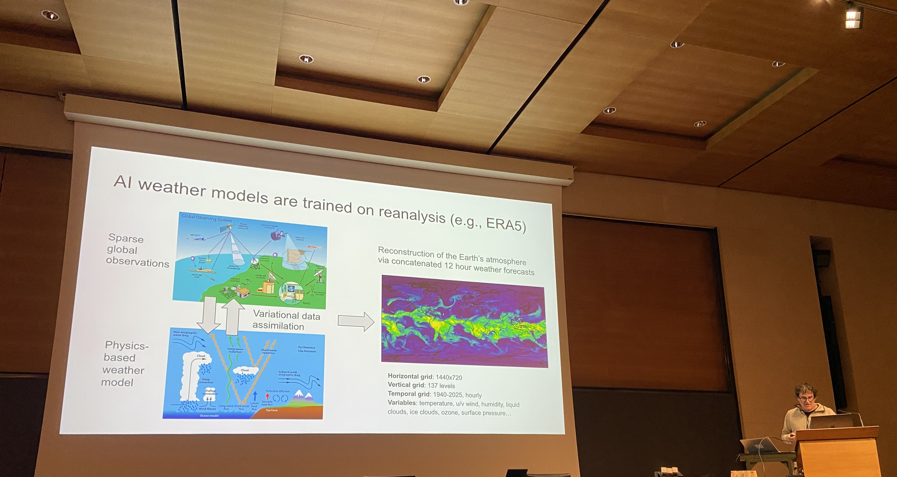
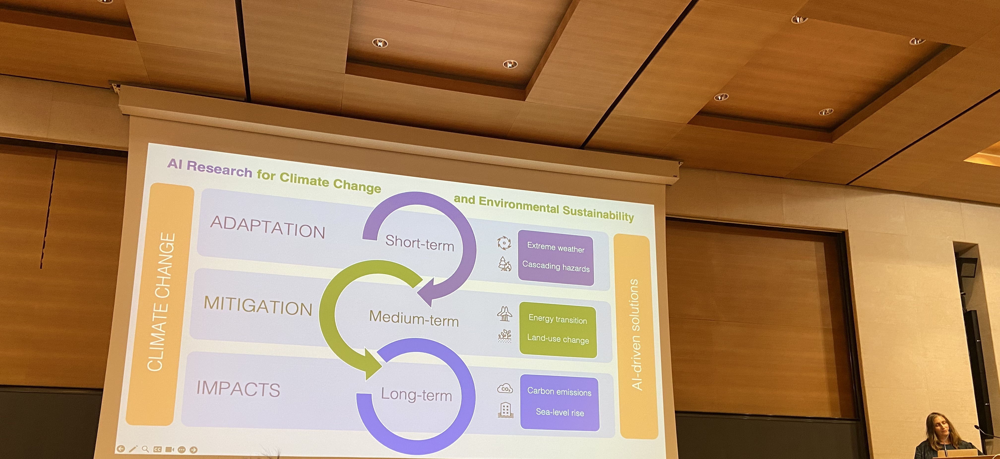
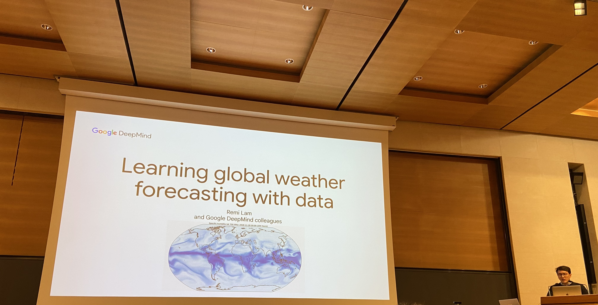

# Collège de France: AI/Math for Meteorology and Climatology

## Openning session – S. Mallat
- Event hosted by Stephane Mallat and Pierre-Louis Lion
- Significant improvements in AI models for weather forecasting, especially in resolution.
- Goal of the conference: bring together mathematics, physics, and AI to address challenges in weather and climate modelling.

Video: https://www.youtube.com/watch?v=YqUrweQfDV0

---

## Michael Brenner – Neural GCM & Learning Force Fields

Video: https://youtu.be/XAMP_0Mya6w?si=FjnTmr3y9uIxVrjm

### Motivation

- Traditional approaches (ODEs/PDEs) require:
    - Manual parameter tuning.
    - Complex implementations (millions of lines of code in Fortran).
- These methods are still very precise—declaring them obsolete is premature.
- Can we **learn** these equations and parameters from data?

### Approach

- Use physical laws to define model structure.
- Define a loss function, use gradient-based optimization.
- Combine data-driven models with physics-informed structures.

### Part 1: Neural GCM

- **ICMWF's IFS**: Top forecasting model until 2023 (then surpassed by Pangu-Weather, GraphCast, NeuralGCM).
- <5 days: deterministic models; beyond: need probabilistic ones.
- ML-based models (e.g., GraphCan, GenCast, …): learn the entire forecast pipeline end-to-end.
- Hybrid models (e.g., NeuralGCM):
    - **Dynamics**: Large-scale simulation on a rotating sphere using primitive equations (optimized with JAX).
    - **Physics**: Small-scale processes (e.g. clouds, radiation) modeled using parameterized, data-driven modules (e.g. neural networks).
- **Key innovation**: Online training by simulating the rollout.
- Ensemble methods to model uncertainty.
- Forecast range: from weeks to **months**.
- Realistic distribution of future event outcomes.
- No need of big models since it captures only very few equations.

### Part 2: Learning Force Fields (Molecular Systems)

- Example: **oxDNA** model (DNA nucleotides modeled as rigid bodies).
- Hundreds of interaction parameters derived from:
    - Structural
    - Mechanical
    - Thermodynamic data
- Re-implemented using **JAX** for differentiability.

### Open Challenge

- Very long-term forecasting (e.g. **50+ days**).
    - This should be achieved by more benchmark for evaluation, and work to better capture physics equations.

### References

- *Data Science at the Singularity*, Donoho (2023)
- Stephan Rasp: Cloud parametrization challenges
- Ouldridge (2011): oxDNA parametrization
- D. Kochkov et al., Neural GCM (2024)

---

## Thomas Dubos – Hamiltonian Insights & Unresolved Processes
Video: https://youtu.be/M4p3x7t7fhM?si=C5wwFAIRq9_SRn81

- Models separate into:
    - **Resolved dynamics**: reversible (fluid motion, gravity, rotation).
    - **Unresolved physics**: irreversible (e.g. turbulence, heat exchange).
- System dynamics: `dX/dt = dX/dt_dynamics + dX/dt_physics`
- Many models stem from **Hamilton's Principle of least action**.
- Turbulence is poorly represented, often lacks energy terms.
- Possible to include turbulence using **additional variables**, even if not latent.

### References

- Morrison (1998)
- Holm, Marsden, Ratiu (2002)

---

## Claire Monteleoni – Generative & Self-Supervised ML for Climate

Video: https://youtu.be/a5kpTC10SxE?si=-8k_K2-MnxhKXJXi

- **Extreme climate events are increasing**, with uneven impacts (climate justice).
- Objective: Develop AI models to **forecast dangerous events** for vulnerable populations.

### Collaboration with EDF

- Focused on wind circulation patterns.
- Investigating **high-resolution variability** despite declining average wind speeds.

### Data Sources

- How to use all available data
- **Simulated**: NWP, GCM, RCM.
- **Reanalysis**: Assimilated observational data.
- **Observational**: Satellites, in-situ measurements.

### ML Techniques

- (Semi/Un/Self)-supervised learning
- Generative AI:
    - VAEs, Normalizing Flows, Diffusion Models
    - Flow Matching
- Learning under **spatio-temporal non-stationarity**

### Key Models

- **STINT**: Self-supervised pretext task for **temporal interpolation**
- **Normalizing Flows**: For **spatial downscaling**
- Use generative AI to **downscale GCM data** to finer resolutions.

### Challenges

- Extreme event detection (are rare by definition)
- Reducing dependence on reanalysis data
- Evaluating generative model outputs

### References

- Rolnick et al., *Application-Driven Innovation in ML*, ICML 2024
- Harilal et al., *STINT*, 2023
- *Flow Matching for Generative Modelling* (2023)
- G. Couairon et al., *ArchesWeatherGen*, 2025

---

## Remi Lam – Learning Global Weather Forecasting from Data

Video: https://youtu.be/PI7OilANWRs?si=bXV85OhYNfq_P8z7

- Goal: Use data to **improve forecast quality** efficiently.

### Why Now?

- Data availability + public benchmarks
- Fast inference (minutes) using TPUs/GPUs
- GNNs with inductive biases (locality, equivariance)

### Methodology

- Fully **data-driven models**, no physical equations.
- Avoid AR (auto-regressive) training due to high cost.
    - Two-phase training: 1-step → multi-step.
    - Weighted losses by atmospheric level.

### Models

- **GraphCast**: RMSE-based, poor with uncertainty.
- **GenCast**: Avoids AR loss; better under uncertainty.

### Innovations

- Sparse adjacency matrix manipulation for more efficient attention.
- Exploring **forecast tracking** via spatial reordering.
- Small models chosen **empirically**, with attention to activations.

### Challenges

- Underperformance in **lower atmospheric levels** (e.g., wind speed).

### Notes

- Combining MLWP and NWP is likely to be similar to hybrid approaches like Neural GCM
- Doesn’t work deeper on the translation forecast into energy production due to a lack of open source dataset.
- No hallucinations observed during their work.

---

## Marc Bocquet – AI for Geophysical Data Assimilation
Video: https://youtu.be/UTSbP5A7LWk?si=XcV7HuO0SCyEk_nZ

- *(Note: content incomplete)*
- Focused on combining AI with **data assimilation** (blending model outputs and observations).

---

## Laure Zanna – Reshaping Climate Modelling with AI
Video: https://youtu.be/9xr2WBzzbPs?si=8nu4Bj6o-zFcl7mr

### Goal

- Use ML to rethink **multi-scale/multi-physics** modeling.
- Achieve greater **efficiency, robustness, and generalization**.

### Challenges

- Physics is granular (e.g. surface speed, ice thickness).
- Resolving large-scale dynamics is easier than mesoscale to micro-turbulence (10 km to meters).
- Discretizing PDEs becomes harder with finer detail.

### Approach

- Combine **physics-based** models with **ML-enhanced** components.
- Use ML for **coarse-resolution emulation** of fine-scale effects.
- Address ongoing problems:
    - Numerical stability
    - Uncertainty quantification
    - Generalization