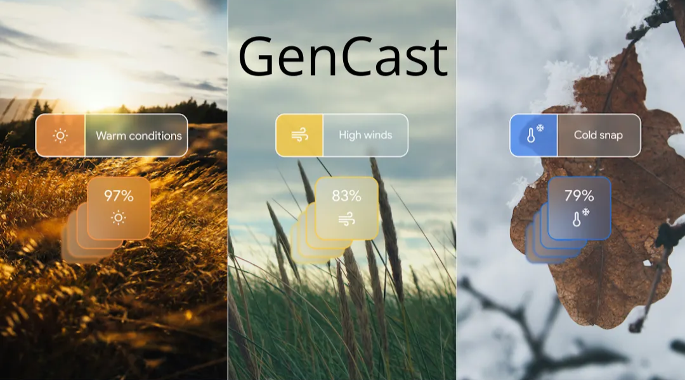
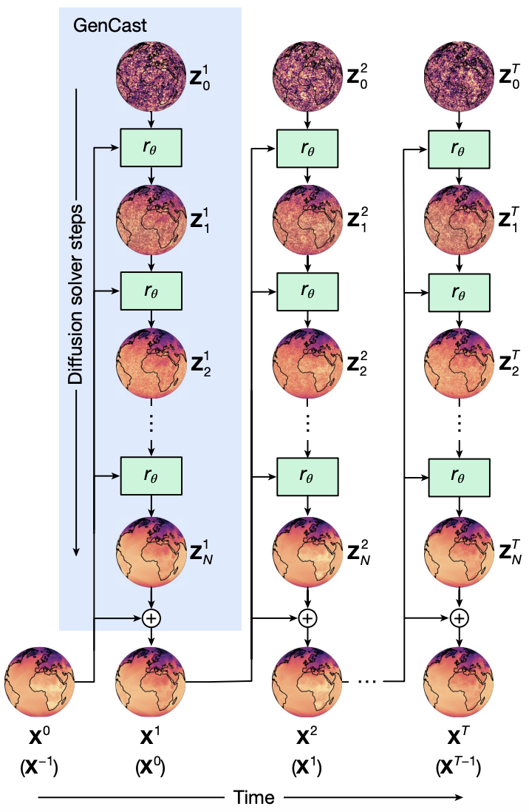
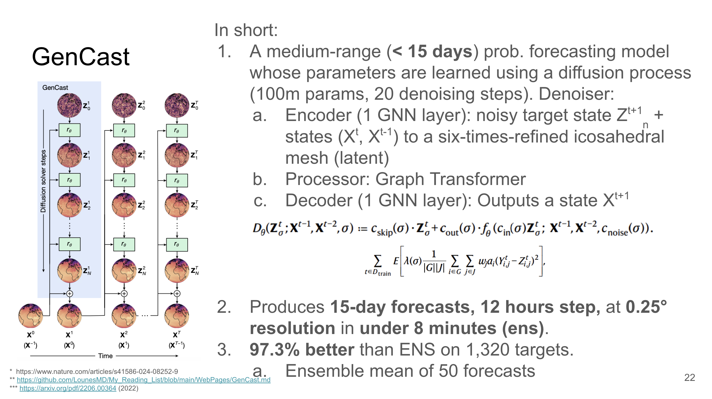

# GenCast: Probabilistic weather forecasting with machine learning

Type: Paper
Link: https://www.nature.com/articles/s41586-024-08252-9

# GenCast

## Introduction / Context

In short, the context is the same as for GraphCast, but GenCast tackles the **probabilistic** side of forecasting.

Instead of relying on traditional **ensemble forecasting** (as ECMWF’s ENS does with NWP) or on Neural‑GCM approaches, GenCast delivers an **end‑to‑end, fast, 0.25 °‑resolution** solution.

GenCast operates with **12‑hour steps**, 0.25 ° horizontal resolution, and **15‑day global forecasts**, producing **ensembles of stochastic forecasts** in about **8 minutes**.

## GenCast:

GenCast teaser image 

GenCast is a **conditional diffusion model** [DM1 – DM3]. Given the two previous Earth states, it **iteratively generates** the next state via a denoising diffusion process. Like GraphCast, it is trained on **40 years of ERA5 reanalysis data**.

### Why diffusion?

Diffusion models are trained to produce **high‑fidelity samples** that look realistic and sharp, whereas a model such as GraphCast—trained with an **MSE loss**—aims for the mean behaviour and therefore tends toward a *blurry* average.

### Technical details

- The fully noised initial state is sampled **on the sphere**. Unlike image diffusion, a simple i.i.d. Gaussian would over‑sample the poles, so the authors adopt a scheme that respects **Earth’s spherical geometry**.
- They run **20 denoising steps** with the **DPMSolver++ 2S** solver [DPMSS].
- Parameter count: **≈ 100 million**.

## Results

GenCast outperforms GraphCast by producing **sharper, less blurry** forecasts.

If you take the **ensemble mean** of 50 GenCast samples, you recover a blur similar to GraphCast—showing that GenCast’s ensemble members are realistic draws from the predictive distribution, whereas GraphCast learns the mean directly.

Because of this, GenCast handles *derived, non‑linear* diagnostics better. Example: **wind‑speed prediction** from wind vectors (u, v). GraphCast first averages (u, v) through its prediction, and then applies the non‑linear magnitude; GenCast samples full vectors first, so the derived speed retains extremes.

For probabilistic verification, the authors use the **spread–skill ratio** and **rank histograms** to check calibration.

*Note:* The ensemble mean’s blurriness visualises how uncertainty broadens the distribution.

## Conclusion:

- GenCast still depends on **ERA5 re‑analysed data**, whereas HRES and ENS uses real‑time analyses.
- The paper suggests **distillation plus higher resolution** as a good way to operational use.
- GitHub repo: https://github.com/google-deepmind/graphcast

## References:

[DM1] T. Kerras et al. Elucidating the Design Space of Diffusion-Based Generative Models (2022)

[DM2] J. Sohl-Dickstein et al. Deep Unsupervised Learning using Nonequilibrium Thermodynamics (2015)

[DM3] Y. Song et al. Score-based generative through stochastic differential equations (2021)

[DPMSS] C. Ly et al. DPM-SOLVER++: Fast Solver for Guided Sampling of Diffusion Probabilistic Models (2022)

