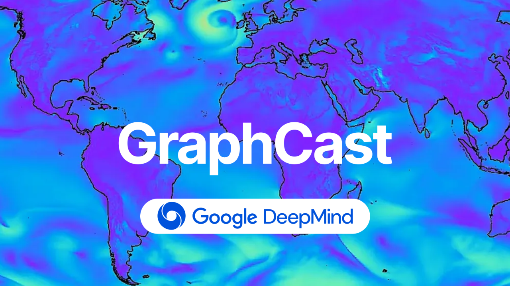
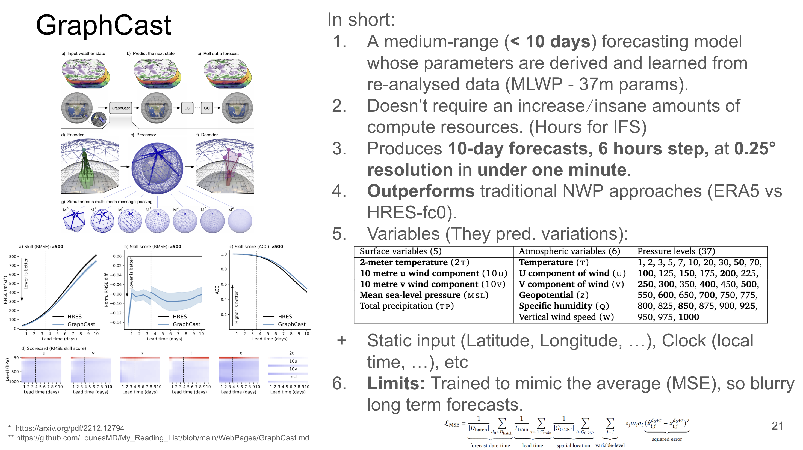

# GraphCast: Learning skilful medium-range global weather forecasting

Type: Paper
Link: https://arxiv.org/pdf/2212.12794

# GraphCast

## Introduction / Context:

In short, their contributions are:

1. A **medium‑range** (< 10 days) forecasting model whose parameters are derived and learned from **re‑analysed data**.
2. **Doesn’t require an increase⧸insane amounts of compute resources.**
3. Produces 10‑day forecasts at 0.25° resolution in **under one minute**.
4. **Outperforms** traditional numerical‑weather‑prediction approaches.

Until now, most it was done by the European Centre for Medium-Range Weather Forecasts (ECMWF) with their Integrated Forecasting System (IFS) (takes many hours to run). Their approach relies on Numerical Weather Prediction (NWP) [IFS1-IFS2]. Basically, they successfully keep having better results thanks to their research to get better equations to model weather phenomena, and increasing compute ressources to run such simulations.

Thus, it scales well with compute ressources, but doesn’t leverage historical data. Which is why, Machine learning-based weather prediction (MLWP) are emerging more and more as an alternative (captures patterns, scales well, etc).

Until now, most of this work has been done by the European Centre for Medium‑Range Weather Forecasts (ECMWF) with its Integrated Forecasting System (IFS), which takes many hours to run. The IFS relies on numerical weather prediction (NWP) [IFS1-IFS2]. ECMWF keeps achieving better results by improving the governing equations and increasing compute resources to run the simulations.

Although the IFS scales well with compute resources, it does not leverage historical data and (compute) expensive. That is why **machine‑learning‑based weather prediction (MLWP)** is emerging as a complementary alternative: ML models capture patterns directly and also scale well with hardware.

## GraphCast:

“GraphCast” is an MLWP model with **36.7 million parameters** that produces *accurate* medium‑range forecasts in about one minute on a single TPU. It is implemented as an **unshared 16‑layer GNN** in an **encode‑process‑decode** configuration [GNNs]. The inputs are ERA5 [ERA5] re‑analysed data.

GraphCast teaser figure

GraphCast input Earth‑state variables

GraphCast takes as input two Earth states—**t−6h** and **t-0h**—and is applied autoregressively to perform medium‑range forecasting. The Earth is gridded at **0.25° resolution** (≈ 28 × 28 km).

## Results:

The results are compared with HRES. They used two different datasets for the two approaches:

- **ERA5** for GraphCast
- **HRES-fc0** for HRES.  In brief, HRES‑fc0 uses an atmospheric analysis at t−6h and a short forecast spanning from t−3h to t+3h, then starts forecasting from t-0h.

The authors ensure that both systems receive the same temporal window of information, so neither has an informational advantage.

*Note:* This is slightly asymmetric because one system uses re‑analysed data and the other does not.

They observe that GraphCast has better long‑horizon skill than HRES overall, although HRES still outperforms GraphCast in the **stratosphere**.

*Note:* It would be interesting to see where each model is better (e.g. calm vs extreme weather conditions).

GraphCast is also evaluated on individual events—tropical‑cyclone tracks, atmospheric‑river landfalls, and extreme heat and cold—and shows competitive accuracy.

## Conclusion

- GraphCast successfully learns approximate physical equations directly from weather‑variable data.
- **Can we use GraphCast for real‑time use cases?** Not yet, because it is trained on ERA5 data.
- **Is GraphCast “better HRES”?** Not exactly. It delivers very good results but at a higher resolution and lower temporal cadence (6 h vs 1 h; 0.25° vs 0.1°).
- It is a very good model that is **quite** small (≈ 36 M parameters).
- Because it is trained with an MSE loss, GraphCast produces a single *average* forecast, unlike the ENS ensemble, which samples a distribution.
- To use GraphCast with Real-time data: GraphCast_operational. Works using HRES data.

## References:

[IFS1] ECMWF Lecture Notes: [https://www.ecmwf.int/en/learning/education-material/lecture-notes](https://www.ecmwf.int/en/learning/education-material/lecture-notes)

[IFS2] ECMWF Technical Memoranda: [https://www.ecmwf.int/en/publications/technical-memoranda](https://www.ecmwf.int/en/publications/technical-memoranda)

[GNNs] Peter W. Battaglia et al. Relational inductive biases, deep learning, and graph networks: [https://arxiv.org/pdf/1806.01261](https://arxiv.org/pdf/1806.01261) (2018)

[ERA5] H. Hersbach et al. The ERA5 global reanalysis: [https://rmets.onlinelibrary.wiley.com/doi/10.1002/qj.3803](https://rmets.onlinelibrary.wiley.com/doi/10.1002/qj.3803) (2020)

[VIDEO] Ferran Allet on GraphCast: [https://www.youtube.com/watch?v=PD1v5PCJs_o](https://www.youtube.com/watch?v=PD1v5PCJs_o)

[GitHub] GraphCast repo: https://github.com/google-deepmind/graphcast

