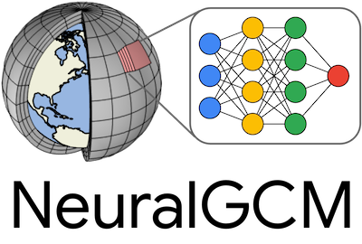
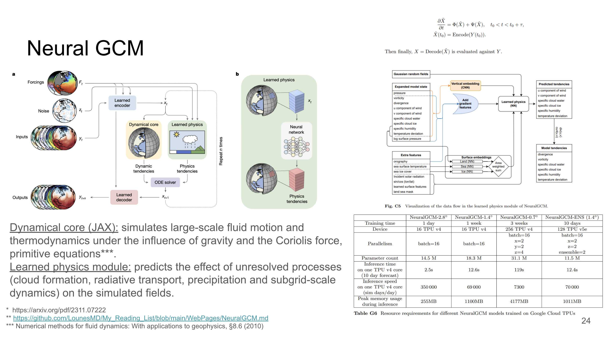

# Neural GCM: Neural general circulation models for weather and climate

Type: Paper
Link: https://arxiv.org/pdf/2311.07222

# Neural GCM

## Introduction / Context

The authors introduce a GCM model, **Neural GCM**, that combines a **differentiable solver** for large‑scale atmospheric dynamics with machine‑learning parameterisations for small‑scale processes. It achieves good forecast skill out to 10–15 days.

Pure ML models rely only on data—there are no hand‑tuned tricks that weight some phenomena over others. They are also easier to maintain: ~5 k LOC for GraphCast versus ~380 k LOC for COSMO and NOAA’s FV3 atmospheric model. However, ML approaches are typically deterministic and, because they are trained with MSE, average out variability and do not represent uncertainty (not the case for GenCast, but GC was probably released after).

Neural GCM addresses this by training a **differentiable hybrid GCM online** for forecasts up to 5 days: the neural network is trained *alongside* the fixed governing equations for large‑scale dynamics.  Specify deterministic 0.7° (~75 km) and ensemble 1.4° (~140 km) versions. Deterministic ≈ 85 M params; ensemble uses the same weights. 

## Neural GCM:

The hardest part for traditional physics‑based models is representing the *sub‑grid* processes. That is precisely where Neural GCM uses a neural network.

- **Dynamical core** – solves fluid dynamics on the grid using standard equations.
- **Learned physics** – a neural network supplies the unknown tendency terms (rain, clouds, evaporation, etc.).
- An **ODE solver** combines the dynamic and physics tendencies to produce the next state, which can then be rolled forward autoregressively for forecasting.

*Previous attempts trained the ML part **offline** using a trusted third‑party simulator—slow, and the model never sees its own mistakes.*

To solve that, they made the process **online**. By re‑implementing the dynamical core in **JAX**, they could differentiate through it and train the ML component *within* the full GCM—so updates account for their impact on the entire simulation, not just local parameterisations. Trained on 5‑day trajectories; evaluated to 10 d (det.) and 15 d (ensemble).

*Advantages:* Like GenCast, Neural GCM produces sharper, more realistic fields than an MSE‑trained deterministic model, outperforming ENS in some extreme‑event metrics.

*Extra:* Because it can generate realistic extremes (e.g. typhoons), forecasters can assess plausibility and prepare if such events appear in reality.

*Note:* Doubling the horizontal resolution makes the simulator roughly **8 × slower**.

As with other recent work, the model is trained on **ERA5** data.

References:

[Video] S. Hoyer, NeuralGCM: [https://www.youtube.com/watch?v=n4Rw3RlpyJw](https://www.youtube.com/watch?v=n4Rw3RlpyJw) (2024)

