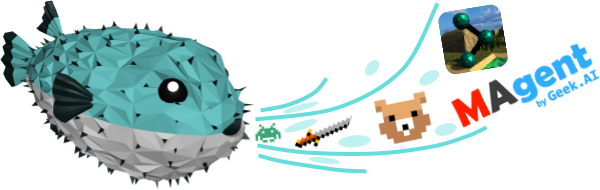

# The Full Reinforcement Learning Iceberg

Type: Video
Link: https://www.youtube.com/watch?v=RIkse0tJ0hE

# **The Full Reinforcement Learning Iceberg**

Reinforcement learning limitations and how pufferLib is (trying to) fixing them.

1. Hyperparemeters tuning:
    1. CARBS runs a lot of fast experiments to find the best hyperparameters.  It is usually better than most current approaches.
2. Sample Efficiency:
    1. In short, If Algo1 uses less samples than AlgoB, it doesn’t mean that AlgoA is more efficient (bc if you can’t let it run for enough hours, you won’t get the results). So looking only for sample efficient algorithms if you don’t have large compute but (almost) unlimited data (ex: RL env.), might actually give worst results than the baselines.   
    2. To get better results, having faster environment can be a better solution.
    3. And actually, using just more data can lead to more sample efficiency than baselines.
3. Algorithms:
    1. PPO and SAC are still SOTA. A lot of papers are published claiming they are better on random environments, but useless. So, looking at environments might be more productive.
4. Learning Libraries:
    1. Most of them are difficult to update, edit, etc. But not PufferLib because it runs faster and as simple as cleanRL. 
5. Vectorization:
    1. With pufferLib, you can vectorize simulations and make it faster.
6. Compatibility:
    1. In short: Everything (complex/simple environments) is expressed as flat data to perform additional optimization (the Emulation layer of PufferLib).
7. Wrappers:
    1. In short: PufferLib fixes not well implemented wrappers, making everything faster.
8. Environments:
    1. With or without PufferLib, some environment are just not implemented for additional optimization.
9. Custom simulation
    1. In short: change the current baseline environments. Move from current low efficient environments to more efficient and better ones.

References:

- PufferLib: Making Reinforcement Learning Libraries and Environments Play Nice, J. Suarez, 2024
- CARBS:  Tune As You Scale: Hyperparameter Optimization For Compute Efficient Training, AJ Fetterman et al., 2023. And ‣
- Sticky actions considered harmful: [https://x.com/jsuarez5341/status/1819399591290458496](https://x.com/jsuarez5341/status/1819399591290458496)