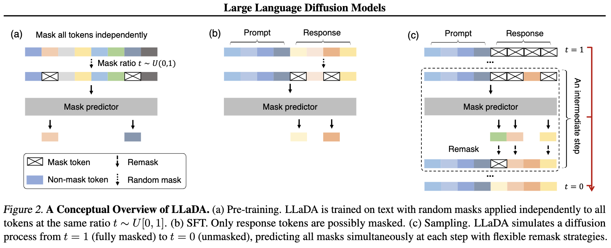
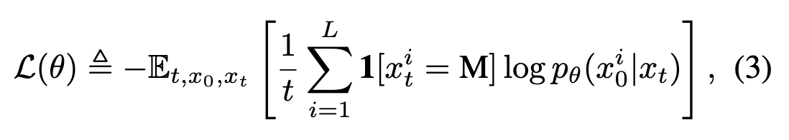

# Large Language Diffusion Models

Type: Paper
Link: https://arxiv.org/pdf/2502.09992

# Large Language Diffusion Models

## LLaDA Principle:

Train a Transformer model in two steps:

1. **Pre-training:**
    - Take inputs, randomly mask tokens, and train the model to predict the masked tokens (CrossEntropy loss).
2. **SFT (Supervised Fine-Tuning):**
    - Concatenate a prompt and the response.
    - Train the model similarly to pre-training, but only on the response tokens.

## Sampling:

- Given a prompt, concatenate a fully masked response to it.
- Train the model to iteratively predict the masked tokens (random, semi-autoregressive).

### Results:

- **Performance:** Comparable to most 8B models.
- **Key Improvement:** Addresses reversal reasoning, and doesn’t use the usual ARM method.

### Claim:

- The **generative modeling principles** make ARM effective, rather than just their autoregressive nature.
- Scalability emerges from **generative modeling**, combined with Transformer architecture, data size, etc.
- **Hypothesis:** "ARM can be seen as a lossless data compressor?"

### Overall:

- A simple yet effective approach.